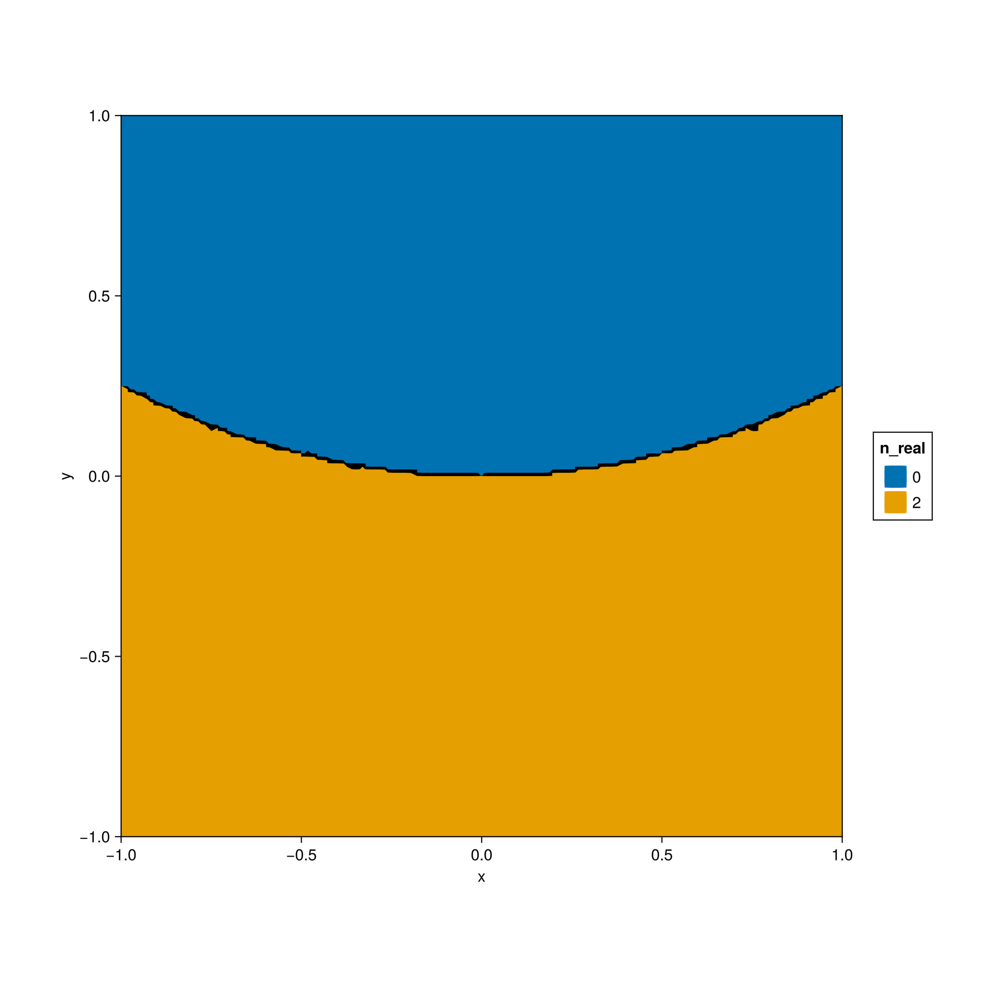
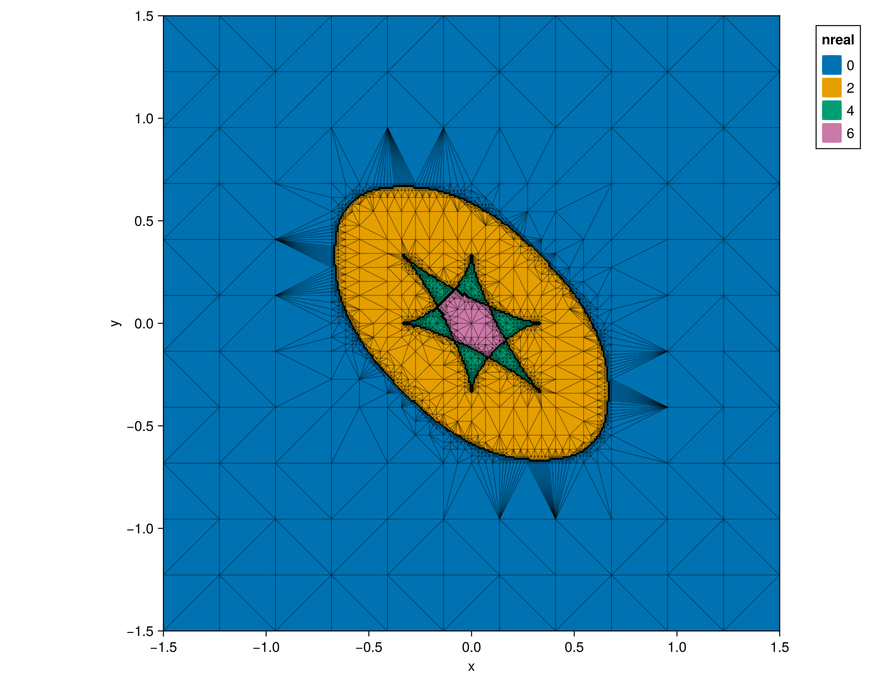
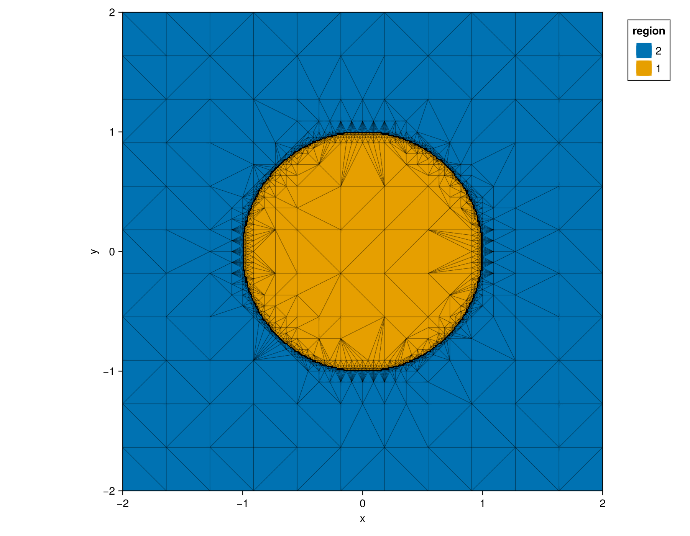
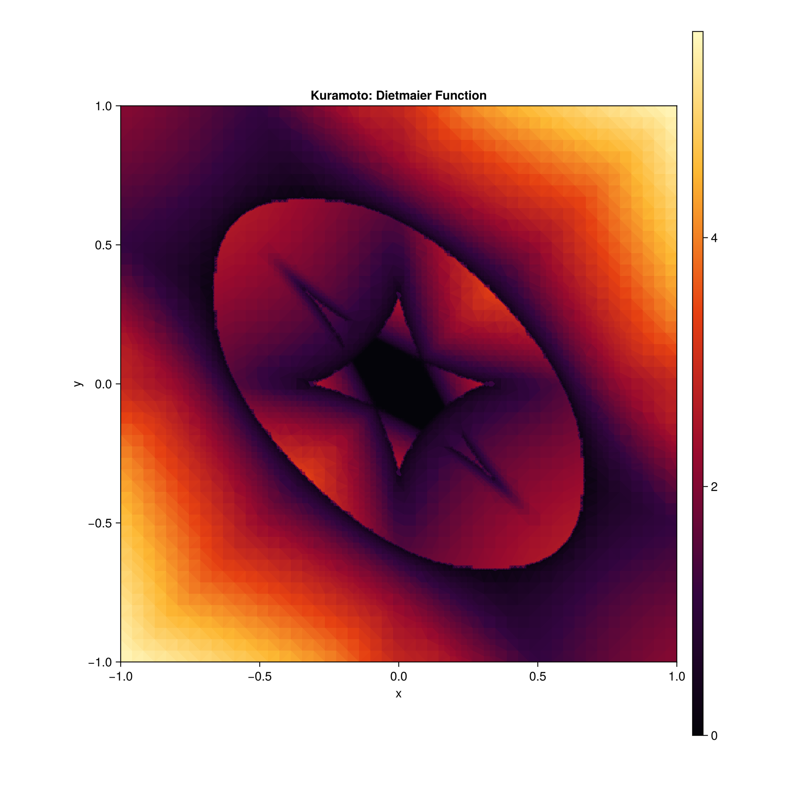

# AdaptiveVisualization.jl

AdaptiveVisualization.jl is general-purpose software for visualizing functions of
two variables. Its main use case is exploring functions defined by the solution
sets of polynomial systems: **how many real solutions are there, and where does
that number change?**

The integration with [HomotopyContinuation.jl](https://www.juliahomotopycontinuation.org/)
lets you enter a polynomial system and begin exploring its parameter space.

[Polynomial systems](#polynomial-systems) · [How it works](#how-it-works) · [Functionality](#functionality)

<details>
<summary><strong>Setup</strong> — Julia 1.11 or later</summary>

Install with Julia’s package manager:

```julia
using Pkg
Pkg.add("AdaptiveVisualization")
Pkg.add("HomotopyContinuation")
```

HomotopyContinuation is optional for ordinary functions.

Interactive plots use GLMakie and require a working OpenGL display.

</details>

## Polynomial systems

### The quadratic equation

Consider the monic quadratic

$$
x^2 + bx + c = 0.
$$

For each point $(b,c)$, count its real roots. Which regions have two distinct real
roots, and which have a pair of nonreal complex conjugate roots?

```julia
using AdaptiveVisualization
using HomotopyContinuation

@var x b c
F = System([x^2 + b*x + c]; variables=[x], parameters=[b, c])

TC, fig = visualize(F;
    xlims=[-3, 3],
    ylims=[-2, 3],
    total_resolution=5000,
    xlabel="b",
    ylabel="c",
    legend_title="Real roots",
)
```

Loading both packages activates the integration automatically. By default,
`visualize(F)` counts real solutions numerically, displays an interactive plot,
and returns the sample cache `TC` and the figure `fig`.

<p align="center">
  
</p>

*Exact reference diagram from the discriminant $b^2-4c$. The package approximates
these regions by sampling and solving the system; it is not given the boundary.*

Below the parabola $c=b^2/4$, there are two distinct real roots. Above it, there
are none. On the parabola, the two roots coincide. This singular boundary is
where numerical solution counting is most delicate.

### Three coupled oscillators

The same workflow applies to systems with several equations and variables.
`kuramoto_model(3)` constructs the polynomial system for the equilibria of three
coupled Kuramoto oscillators. After fixing one oscillator's phase, the system has
four variables, four equations, and two frequency parameters.

```julia
KM3 = kuramoto_model(3)

TC, fig = visualize(KM3;
    xlims=[-1.5, 1.5],
    ylims=[-1.5, 1.5],
    total_resolution=5000,
    xlabel="ω₁",
    ylabel="ω₂",
    legend_title="Real solutions",
    edges=true,
)
```

<p align="center">
  
</p>

*A representative Kuramoto visualization. The horizontal and vertical coordinates
are the two frequency parameters. Refinement concentrates samples near changes
in the real-solution count; the triangle edges show where that work was spent.*

## How it works

The accompanying manuscript, *Adaptive Visualization for Enumerative Problems*
by Taylor Brysiewicz and Noah Vale, describes the architecture. The basic process
is:

1. **Sample.** Evaluate the function on an initial grid in the chosen window.
2. **Triangulate.** Build a Delaunay triangulation of the sampled points.
3. **Compare.** Check whether each triangle's vertex values agree, using a
   tolerance for continuous data.
4. **Refine.** Add samples to triangles that fail this check, update the
   triangulation, and repeat until the chosen stopping condition is met.

For polynomial systems, evaluating the function means solving at a parameter
point and extracting a value, such as the number of real solutions. The
HomotopyContinuation integration prepares starting solutions once and uses
parameter homotopies to evaluate new samples.

No polynomial system is required. For example, distinguish points inside and
outside the unit disk:

```julia
f(x, y) = x^2 + y^2 < 1 ? 1 : 2

TC = TriangulationCache(f;
    xlims=[-2, 2],
    ylims=[-2, 2],
    resolution=144,
)

for _ in 1:5
    refine!(TC)
end

fig = visualize(TC; edges=true, legend_title="region")
```

<p align="center">
  
</p>

*Large triangles remain where the sampled values agree. Smaller triangles trace
the circular boundary where they differ.*

Agreement at the vertices is a local stopping rule, not a proof that the function
is constant throughout a triangle. Small features can be missed if the initial
samples do not encounter them.

## Functionality

### Choose what to measure

Pass `func` when visualizing a polynomial system:

| Option | Value at each parameter point |
| --- | --- |
| `:real` (default) | Numerical count of real solutions. |
| `:positive` | Numerical count of real solutions with every variable coordinate positive. |
| `:certify_real` | Real-solution count using certification and checks for nonreal solutions. |
| `:dietmaier` | Smallest imaginary L1 norm above a threshold, or zero if none exceeds it. |

```julia
TC, fig = visualize(KM3; func=:positive)
```

Reusable evaluators are also available:

```julia
count_real = real_solution_function(F)
counts = count_real([[0.0, -1.0], [0.0, 1.0]])  # [2, 0]
```

The other constructors are `positive_solution_function`, `certify_real`, and
`dietmaier_function`.

<details>
<summary>Counting, tolerances, and unresolved samples</summary>

Counts depend on a complete set of starting solutions. The automatic monodromy
search and subsequent certification do not independently prove that this set is
complete. If a complete starting fibre is known, supply `start_parameters` and
`start_solutions` together.

Certification concerns the numerical system supplied to HomotopyContinuation;
it does not establish robustness to coefficient rounding.

Numerical modes use `real_tol=1e-8` to identify real solutions. Positive solutions
must also have every real coordinate greater than `positivity_tol=0.0`.
The Dietmaier threshold is `imaginary_zero_atol=1e-10`.

Samples that remain unresolved after retries are returned as `:wildcard`.
These values are ignored when comparing vertex values and should not be
interpreted as a solution count. The default parity check assumes that each
fibre is invariant under complex conjugation; for complex-coefficient families
without this property, use `wildcard_parity_mismatch=false`.

</details>

### Control sampling and refinement

| Operation | Effect |
| --- | --- |
| `visualize(f; total_resolution=5000)` | Initialize, refine, and display; return `(TC, fig)`. |
| `TriangulationCache(f; resolution=144)` | Build the initial mesh without refining or plotting. |
| `refine!(TC)` | Perform one refinement pass. |
| `refine!(TC; budget=1000)` | Add up to 1,000 samples, stopping early if no eligible points remain. |
| `refine!(TC; min_refinement_area=1e-5)` | Refine until no eligible triangle exceeds this fraction of the window area. |
| `visualize(TC)` | Plot an existing cache and return the figure. |

For `visualize(f)` or `visualize(F)`, the default total is 1,000 sampled input
points. Roughly one quarter is used for the initial grid; use
`initial_resolution` to change that target. Actual grid sizes can be smaller.
These budgets count sampled points, not solver path tracks or batch calls.

An explicit `initial_resolution` larger than the default total raises the total
automatically. If both are supplied, the initial target must not exceed the
total. Supplying a positive `min_refinement_area` to `visualize` selects
area-based refinement instead of the total-point budget.

Refinement strategies are `:sierpinski` (edge midpoints, the default),
`:barycenter` (triangle centres), and `:random` (random interior points).

### Explore interactively

| Control | Action |
| --- | --- |
| **Refine** | Add another refinement pass. |
| **Fully Refine** | Refine to the minimum triangle area selected by the slider. |
| **Arrow buttons** | Pan the parameter window. |
| **Zoom + / −** | Zoom in or out. |
| **Edges** | Toggle the triangulation overlay. |

The cache retains previous evaluations when navigating. A new window is seeded
and refined unless it is **completely contained in a previously seeded window**.
Use `buttons=false` for a figure without controls.

### The Dietmaier function

Beyond solution counts, you can visualize real-valued quantities computed from
solution sets. Among the computed solutions, the Dietmaier function takes the
smallest imaginary-part L1 norm exceeding `imaginary_zero_atol` (default
`1e-10`), or zero if none does. Small positive values indicate a computed
solution with a small imaginary part.

```julia
TC, fig = visualize(kuramoto_model(3);
    func=:dietmaier,
    xlims=[-1, 1],
    ylims=[-1, 1],
    total_resolution=10000,
    title="Kuramoto: Dietmaier Function",
)
```

<p align="center">
  
</p>

*The Dietmaier function over the two frequency parameters. 

### Ordinary functions

Functions can take separate coordinates, one point, or a batch of points:

```julia
f(x, y) = x^2 + y^2 < 1 ? 1 : 2
TC, fig = visualize(f; xlims=[-2, 2], ylims=[-2, 2])

g(p) = p[1]^2 + p[2]^2 < 1 ? 1 : 2
TC, fig = visualize(g; batched=false)

h(points) = [g(p) for p in points]
TC, fig = visualize(h; batched=true)
```

Without `batched`, the calling convention is inferred. Set it explicitly when
a function could accept either one point or a collection of points.

Numeric samples with fewer than 50 distinct observed values are treated as
discrete; otherwise they are treated as continuous. Nonnumeric labels are
categorical. The software is intended for a modest number of distinguishable
categories, rather than hundreds of separate colours. For continuous data, the
default agreement tolerance is one sixteenth of the initial sampled range.

### Slice a higher-dimensional space

For a polynomial system with more than two parameters, the default view uses a
random plane through the origin. Set `near=p` to centre that plane at `p`, or
choose three points to specify it explicitly:

```julia
KM4 = kuramoto_model(4)

p = [0.0, 0.0, 0.0]
q = [1.0, 0.0, 0.0]
r = [0.0, 1.0, 0.0]

TC, fig = visualize(KM4; plane_points=[p, q, r])
```

Plot coordinates $(u,v)$ represent the original parameter vector

$$
p + \mathrm{zoomer}\bigl(u(q-p) + v(r-p)\bigr).
$$

The directions are used at their supplied lengths. `plane_points` overrides
`near`; `xlims` and `ylims` always refer to plot coordinates. `zoomer` defaults
to `1.0`. Pass `rng=MersenneTwister(42)` after `using Random` to reproduce a
random slice.

Ordinary functions support the same slicing options. Supply their input
dimension, or let it be inferred from `near` or `plane_points`:

```julia
f(p) = sum(abs2, p)
TC, fig = visualize(f; input_dimension=4, batched=false)
```

For a sliced cache, `TC.parameter_slice([u, v])` returns the corresponding
original coordinates. When using an evaluator such as
`real_solution_function(F; plane_points=...)`, choose the slice there and pass
the evaluator directly to the cache or visualizer.

### Retrieve examples and save figures

For a discrete cache, retrieve one sampled point for each distinct observed
value:

```julia
TC, fig = visualize(KM3)
witnesses = retrieve_witnesses(TC)
```

Witnesses use original coordinates for sliced functions and polynomial systems,
and plot coordinates otherwise. Retrieval uses all cached samples, skips
`:wildcard`, and does not evaluate the function again.

Save a figure to `OutputFiles/kuramoto.png`:

```julia
AdaptiveVisualization.save(fig, "kuramoto"; dpi=300)
```

For labels and layout, use `title`, `xlabel`, `ylabel`, `legend_title`,
`show_legend`, `edges`, and `figure_size`.

## License

AdaptiveVisualization.jl is available under the [MIT license](LICENSE).
